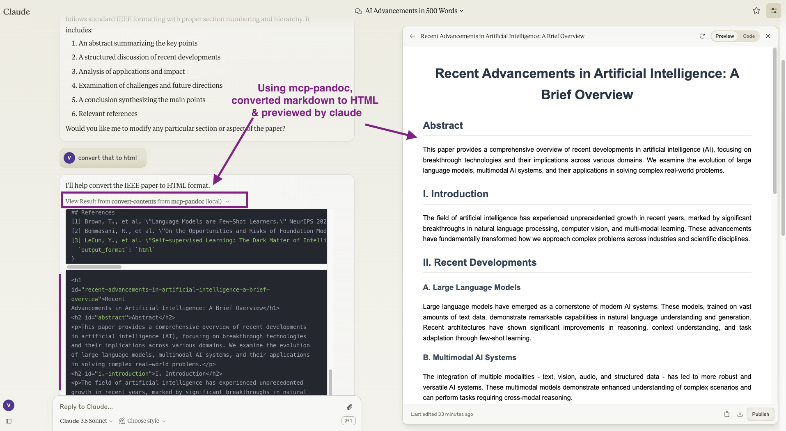
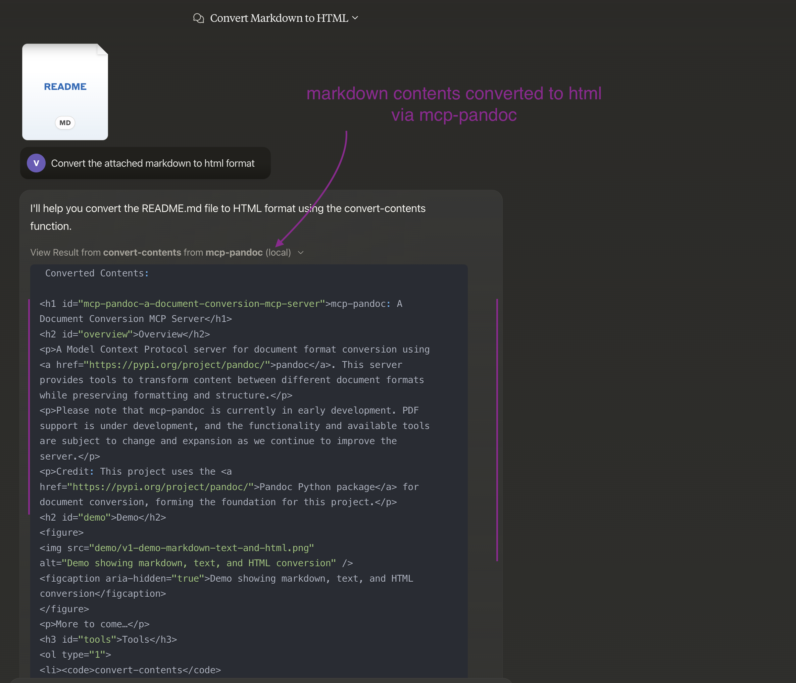

# mcp-pandoc: A Document Conversion MCP Server

> Officially included in the [Model Context Protocol servers](https://github.com/modelcontextprotocol/servers/blob/main/README.md) open-source project. 🎉

<a href="https://glama.ai/mcp/servers/xyzzgaj9bk"></a>

## Overview

A Model Context Protocol server for document format conversion using [pandoc](https://pandoc.org/index.html). This server provides tools to transform content between different document formats while preserving formatting and structure.

Please note that mcp-pandoc is currently in early development. PDF support is under development, and the functionality and available tools are subject to change and expansion as we continue to improve the server.

Credit: This project uses the [Pandoc Python package](https://pypi.org/project/pandoc/) for document conversion, forming the foundation for this project.

## Demo

[](https://youtu.be/vN3VOb0rygM)

> 🎥 [Watch on YouTube](https://youtu.be/vN3VOb0rygM)


<details>
<summary>Screenshots</summary>




</details>

More to come...

## Tools

1. `convert-contents`
   - Transforms content between supported formats
   - Inputs:
     - `contents` (string): Source content to convert
     - `output_format` (string): Target format (html, markdown, text)
   - Returns: Converted content in the target format

### Supported Formats

Currently supported formats:

- Plain text
- Markdown
- HTML
- DOCX (.docx)
- PDF

In development:

- CSV, etc.

## Usage & configuration

To use the published one

```bash
{
  "mcpServers": {
    "mcp-pandoc": {
      "command": "uvx",
      "args": ["mcp-pandoc"]
    }
  }
}
```

## Quickstart

### Install

#### Claude Desktop

On MacOS: `~/Library/Application\ Support/Claude/claude_desktop_config.json`
On Windows: `%APPDATA%/Claude/claude_desktop_config.json`

<details>
  <summary>Development/Unpublished Servers Configuration</summary>
  
  ```bash
  "mcpServers": {
    "mcp-pandoc": {
      "command": "uv",
      "args": [
        "--directory",
        "/Users/vivekvells/Desktop/code/ai/mcp-pandoc",
        "run",
        "mcp-pandoc"
      ]
    }
  }
  ```
  
</details>

<details>
  <summary>Published Servers Configuration</summary>

  ```bash
  "mcpServers": {
    "mcp-pandoc": {
      "command": "uvx",
      "args": [
        "mcp-pandoc"
      ]
    }
  }
  ```

</details>

## Development

### Building and Publishing

To prepare the package for distribution:

1. Sync dependencies and update lockfile:

```bash
uv sync
```

2. Build package distributions:

```bash
uv build
```

This will create source and wheel distributions in the `dist/` directory.

3. Publish to PyPI:

```bash
uv publish
```

Note: You'll need to set PyPI credentials via environment variables or command flags:

- Token: `--token` or `UV_PUBLISH_TOKEN`
- Or username/password: `--username`/`UV_PUBLISH_USERNAME` and `--password`/`UV_PUBLISH_PASSWORD`

### Debugging

Since MCP servers run over stdio, debugging can be challenging. For the best debugging
experience, we strongly recommend using the [MCP Inspector](https://github.com/modelcontextprotocol/inspector).

You can launch the MCP Inspector via [`npm`](https://docs.npmjs.com/downloading-and-installing-node-js-and-npm) with this command:

```bash
npx @modelcontextprotocol/inspector uv --directory /Users/vivekvells/Desktop/code/ai/mcp-pandoc run mcp-pandoc
```

Upon launching, the Inspector will display a URL that you can access in your browser to begin debugging.

---

## Contributing

We welcome contributions to enhance mcp-pandoc! Here's how you can get involved:

1. **Report Issues**: Found a bug or have a feature request? Open an issue on our [GitHub Issues](https://github.com/vivekVells/mcp-pandoc/issues) page.
2. **Submit Pull Requests**: Improve the codebase or add features by creating a pull request.

---
